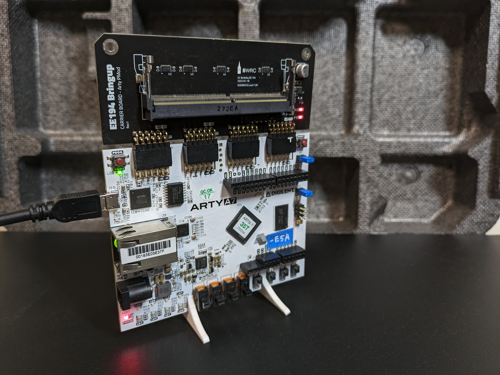
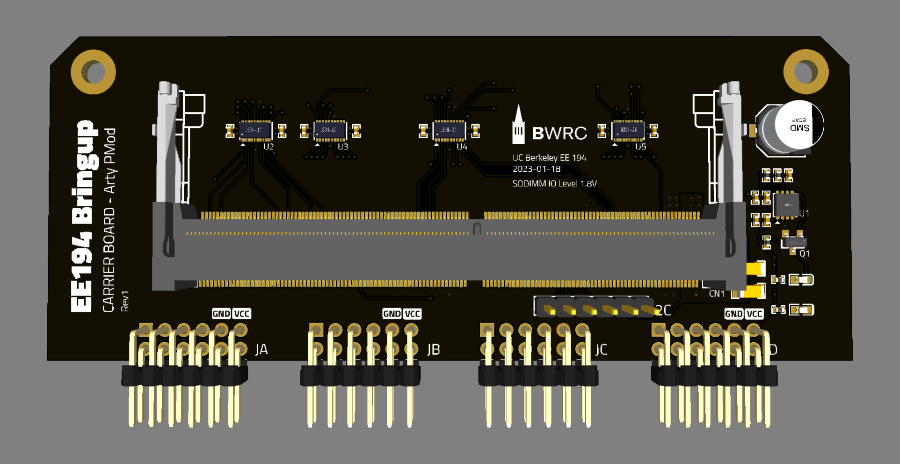
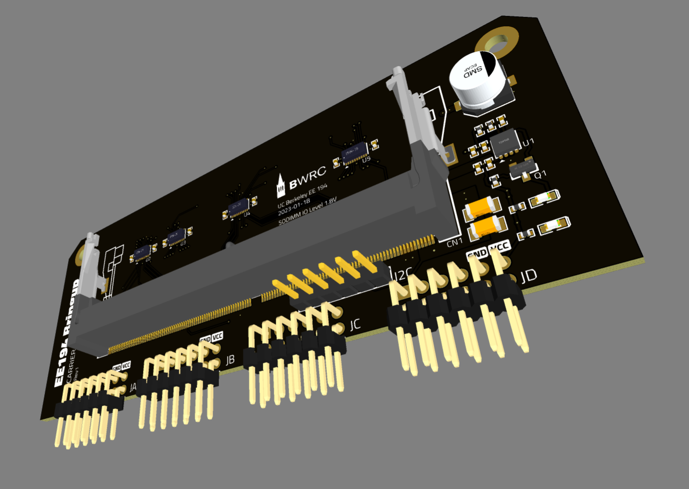
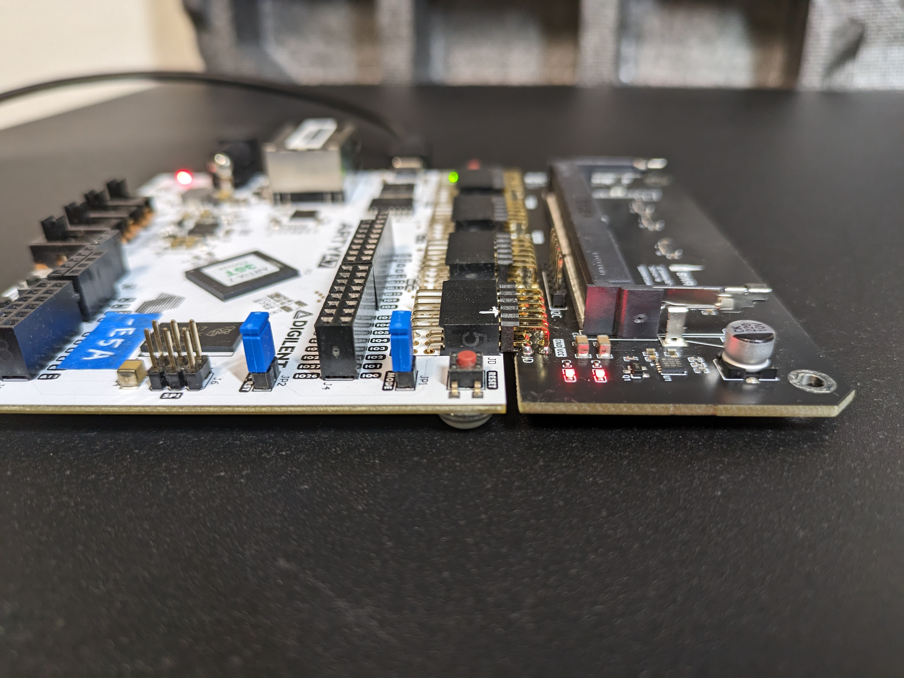

# BearlyML Carrier Arty PCB

This is an adapter board between BearlyML Module board and the Arty 35T / 100T FPGA.

## Functional Description

This board level-shifts between the BearlyML 1.8V signal and the Arty PMOD 3.3V signal using the [TXB0108DQSR](https://www.digikey.com/short/mvzwjjp7) level shifter. 

## Project Links

[BearlyML 2022 SoC Specification](https://docs.google.com/document/d/1Ldz2ZDB1uXTN-R59TmTNYh7_aXbSfiJJrKeP0uHo0qY/edit?usp=sharing)

[BearlyML 2022 Testing Note](https://docs.google.com/presentation/d/11BuBN2AjHtR5hc7lh9h7Z0UspvnxgiJxumvH6YZSuuI/edit?usp=sharing)

[PCB Project on GitHub](https://github.com/ucb-ee290c/BearlyML-Arty-FPGA-PCB)

[PCB Project on Altium 365](https://ucb-bar.365.altium.com/designs/37B6BC0A-9DBB-47C5-8C42-4A4CADA3A758#design)

[PCB Project on LCEDA](https://lceda.cn/editor#id=10e6a497bc3b4d0ba6b3146a791dbbba|b137350678f4478c931cfbcba87ce0c4|037f49d65316436faf2b81830ce06c8c|9a71b296f1f1483798a26e552317a1fd)

[PCB Project in BWRC-Boards](https://bwrcrepo.eecs.berkeley.edu/pcb/bearlyml-arty-carrier)

## Schematic

[View on Altium 365](https://ucb-bar.365.altium.com/designs/37B6BC0A-9DBB-47C5-8C42-4A4CADA3A758#design)

[Schematic PDF](schematic-pdf/Schematic_BearlyML%20Carrier%20Arty%20Board_2023-10-24.pdf)

## Fabrication Specifications

| Key | Value |
| ---- | ------ |
| Build Time | 4-5 days |
| Layers | 4  |
| PCB Qty | 5 |
| PCB Thickness | 1.6 mm |
| Base Material | FR-4 |
| Material Type | FR4-Standard TG 135-140 |
| Dimension | 108 mm* 70 mm |
| Product Type | Industrial/Consumer electronics |
| Impedance Control | no |
| Silkscreen | White |
| PCB Color | Black |
| Surface Finish | LeadFree HASL |
| Via Covering | Tented |
| Outer Copper Weight | 1 oz |
| Inner Copper Weight | 0.5 oz |
| Castellated Holes | no |
| Min hole size/diameter | 0.2/0.45mm↑ |
| Flying Probe Test | Fully Test |
| Remove Order Number | Specify a location |
| Appearance Quality | IPC Class 2 Standard |
| Silkscreen Technology | Ink-jet/Screen Printing Silkscreen |

Manufactured with [JLCPCB](https://jlcpcb.com/).

## Manufacture Cost

PCB: $11.78 each

Assembly: $20.80 each excluding BOM part cost

Total: $162.82 for 5 pcs

## 3D View

## Real World View

#### Assembled with Arty 35T

#### Assembled with Arty 35T and BearlyML Module board

